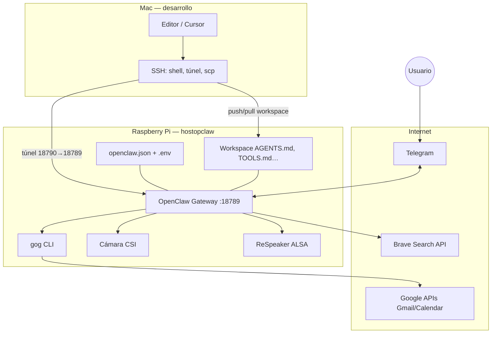

# OpenClaw en Raspberry Pi (hostopclaw)

Repositorio de documentación y **workspace del agente** para un OpenClaw corriendo en una **Raspberry Pi 4** (Debian / Raspberry Pi OS), usuario `serv_openclaw`. El gateway escucha en **loopback** (`127.0.0.1:18789`); el acceso desde la red local se hace por **SSH** (túnel al dashboard, `scp`, etc.).

## Qué incluye este proyecto

| Componente | Descripción |
|------------|-------------|
| **OpenClaw Gateway** | Servicio `systemd` de usuario: `openclaw-gateway`. Config: `~/.openclaw/openclaw.json`. |
| **Telegram** | Canal principal para hablar con el agente. |
| **Cámara** | Pi Camera Module 3 (CSI); capturas con `rpicam-still` en el host del gateway. |
| **Audio** | ReSpeaker 2-Mics Pi HAT v2 (entrada/salida ALSA); voz al bot vía Telegram desde el móvil. |
| **Gmail y Calendar** | CLI **[gog](https://gogcli.sh/)** con OAuth (Google Cloud); entorno para el daemon en `~/.openclaw/.env`. |
| **Búsqueda web** | Brave Search API (`web_search` en el gateway). |
| **Workspace** | Markdown del agente (`AGENTS.md`, `TOOLS.md`, etc.) en `workspace/`; en la Pi: `~/.openclaw/workspace/`. |

Guía de instalación del sistema y estado probado: [`02-setup-sistema-openclaw.md`](02-setup-sistema-openclaw.md). Flujos adicionales: [`01-instalacion-OS-RPi4.md`](01-instalacion-OS-RPi4.md), [`03-servicio-systemd-manual.md`](03-servicio-systemd-manual.md).

## Arquitectura

Visión lógica: el **cerebro del agente** es el **gateway** en la Pi; los canales (Telegram) y las herramientas (`web_search`, shell/`gog`, cámara) se ejecutan en ese host o se invocan desde él.



**Flujo de datos (resumen)**

1. **Telegram:** mensajes/voz llegan a los servidores de Telegram; el bot en la Pi se conecta al gateway y el modelo responde por el mismo canal.
2. **Dashboard:** desde el Mac, `ssh -L 18790:127.0.0.1:18789 …` y navegador en `http://localhost:18790` (requiere token del gateway si está configurado).
3. **Workspace:** edición local en `workspace/*.md`; despliegue a la Pi con `./push-workspace.sh` (ver abajo).
4. **gog:** el agente ejecuta comandos `gog` en la shell del gateway; credenciales OAuth en `~/.config/gogcli/`; variables sensibles en `~/.openclaw/.env` (no commitear).

## Estructura del repositorio

```
openclaw_rpi/
├── README.md                 # Este archivo
├── 01-instalacion-OS-RPi4.md # Imager, OS Lite, SSH
├── 02-setup-sistema-openclaw.md  # Node, OpenClaw, dashboard, estado instalado
├── 03-servicio-systemd-manual.md # Detalle del servicio (referencia)
├── push-workspace.sh         # Sube workspace/*.md a la Pi
├── pull-workspace.sh         # Trae workspace desde la Pi
└── workspace/                # Workspace del agente (edición local)
    ├── README.md             # Sync y tabla de archivos
    ├── AGENTS.md
    ├── TOOLS.md              # Cámara, gog, Brave, convenciones
    └── …
```

## Sincronizar el workspace con la Pi

Desde la raíz del repo (en tu Mac):

```bash
./push-workspace.sh   # Pi ← archivos locales
./pull-workspace.sh   # Pi → archivos locales
```

Host por defecto en los scripts: `serv_openclaw@hostopclaw.local` (primer argumento para otra IP/host).

## Enlaces útiles

- [OpenClaw](https://openclaw.ai/) · [Documentación](https://docs.openclaw.ai/)
- [gog / Google en terminal](https://gogcli.sh/)
- [Workspace del agente](https://docs.openclaw.ai/concepts/agent-workspace)

---

*Proyecto personal: nombres de host y rutas asumen `hostopclaw` y usuario `serv_openclaw`; ajusta según tu red.*
